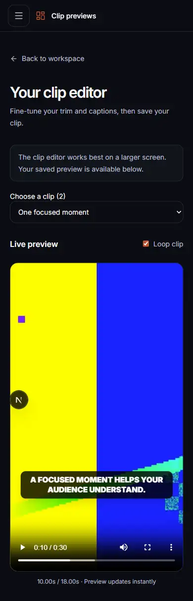

# VS4 and VS5 acceptance audit

Date: 2026-09-14, 10:54–11:12 (Asia/Manila).

Result: all VS4 and VS5 acceptance criteria are met after the preview fixes below.
The audit checked the implementation, current automated tests, authenticated browser behavior,
and the previous live AI verification recorded in the tracker and ADR 0001.

## Findings and fixes

- The VS5 mobile fallback hid the entire clip chooser, leaving only the first VS4 candidate
  accessible. Added a labeled mobile selector using the existing unsaved-change guard.
- Floating-point subtraction rejected valid one-millisecond trims such as 1–1.001 and 2–2.001.
  Validation now compares millisecond boundaries and is shared by field feedback and saving.
- A fixed 20 ms playback tolerance could stop a short trim immediately at its start. The tolerance
  is capped at half the clip duration. Pressing Play after reaching the end also restarts the clip.

Eight new regression cases cover millisecond trims, invalid boundaries, short playback, and replay.
The timing regression cases failed before the fixes and pass afterward.

## VS4 criteria

| Criterion | Evidence |
| --- | --- |
| Processing continues in background | Retained BullMQ consumer and durable lifecycle; PostgreSQL/Redis pipeline integration test reaches persisted `preview_ready` without a browser. |
| Whisper produces timestamps | Local subprocess returns validated segment/word timestamps; transcript persistence and retry tests pass. The original tracker records a real CPU/int8 Whisper smoke. |
| Gemini receives transcript, not raw video | Pipeline passes duration and timestamped text only; prompt and selector contract tests verify the request. |
| 5–10 candidates when possible | Versioned prompt targets five; selector bounds, deduplicates, promotes backups, and repairs short responses. Original live Gemini smoke records five validated primaries. Short sources may yield fewer. |
| Backup candidates stored | Pipeline maps both kinds; integration tests verify atomic primary/backup persistence and owner-only primary reads. Original live smoke records two backups. |
| Preview before final render | Authenticated source streaming returns HTTP 206; browser switching, playback, stopping, and replay verified. Mobile selection is fixed. |
| No final MP4 render yet | Analysis pipeline persists metadata only; audit fixture has zero render jobs. |

## VS5 criteria

| Criterion | Evidence |
| --- | --- |
| Trim | Browser saved 1–1.001 seconds and restored it after reload, then saved a 2–8 second trim; regression and bounds tests pass. |
| Caption toggle | Disabled captions, saved, reloaded; checkbox remained off and overlay absent. |
| Caption text | Edited to “Clear stories make ideas useful.”; saved text restored on reload. |
| Caption position | Saved “Bottom safe”; reload and database confirmed `{ x: 0.5, y: 0.84 }`. |
| Font size | Saved “Extra large”; reload and database confirmed font size 80. |
| Highlighted words | Added “Clear stories”; colored overlay appeared and the highlight survived reload. |
| Restore saved metadata | Authenticated GET/PATCH and PostgreSQL round trip verified; revision-conflict, ownership, atomicity, and baseline-preservation integration tests pass. |
| No render during edits | Observed metadata GET/PATCH and source reads only; zero render jobs, zero credit ledger entries, and exactly one original synthetic analysis job remained. |

## Validation

- `pnpm ci:check`: passed, 497 unit tests and 58 PostgreSQL/Redis integration tests, formatting,
  lint, typecheck, and all production builds. Integration suites skipped in the unit run were
  executed separately by the integration gate.
- Browser checks at 320, 390, 768, 1024, and 1440 pixels: no horizontal overflow; mobile can select
  the second clip; tablet retains panel tabs; desktop editing and save/reload work.
- Browser playback with looping disabled stopped at 8 seconds; pressing Play resumed within the
  selected 2–8 second segment. No application console warnings or errors on the verified page.
- `git diff --check`: passed.
- The existing Next.js file-tracing warning remains non-fatal. No new dependencies, migrations,
  or environment settings are required.

This audit did not repeat a paid Gemini call or full real-video transcription. Those checks rely on
the previously recorded live VS4 evidence; current automated tests use deterministic AI substitutes.
Browser verification used a new disposable account with a copy of the existing 30-second synthetic
fixture, the real authenticated API, PostgreSQL, and private source streaming. Local fixtures and
logs are ignored under `storage/vs45-audit`; they are not source files.

## Mobile result

The second candidate can now be selected and previewed on a phone:

