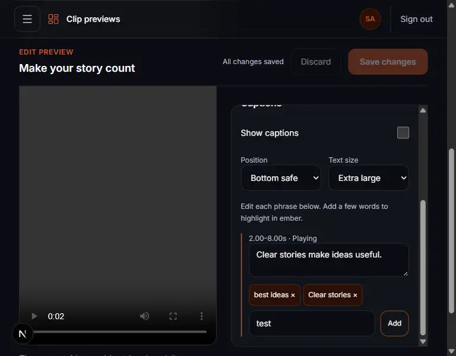

# VS5 settings panel overflow fix

Completed 2026-09-27, 13:01–13:13 Asia/Manila.

The trim and caption settings card could extend below a short viewport, while only
the caption phrase list had its own height limit. The whole settings card now uses
a viewport-relative maximum height and vertical scrolling, with a stable scrollbar
gutter. It stays below the editor toolbar as the page scrolls. The nested caption
list scrollbar was removed so all settings share one scroll area.

## Browser verification

Used the existing synthetic VS4/VS5 audit account and clip in local Chrome:

- **1280 × 720:** scrolled to the highlight input, added a phrase, and discarded
  the draft; the Add button was fully visible and functional.
- **768 × 600:** keyboard navigation reached the Add button; its bottom edge was
  at 567px, inside the viewport. The settings card scrolled to reveal it.
- **1024 × 480:** keyboard navigation reached Add; its bottom edge was at 447px,
  inside the viewport. The settings card was 288px tall including its border.
- **1440 × 900:** desktop settings remained available.
- **320 × 640:** the existing larger-screen editing fallback and clip selector
  remained available.
- No horizontal page overflow at any of the checked sizes.

The synthetic source media was unavailable during this layout check. Playback was
not reverified; the saved metadata and editing controls remained usable. No clip
edits were saved.

## Automated checks

- Formatting, lint, and type checking passed.
- 497 unit tests passed.
- 58 PostgreSQL/Redis integration tests passed on rerun. The first run passed all
  assertions but reported four database connection errors during cleanup.
- Production builds passed with the existing non-fatal Next.js file-tracing warning.

The initial formatting check found existing CRLF differences in 27 files. Those
were normalized without changing their Git content. No migrations or dependencies
were added.
