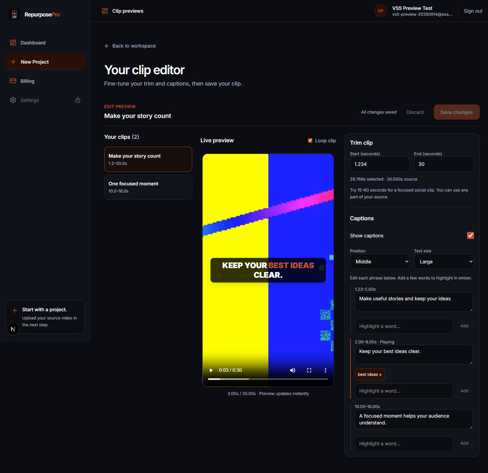
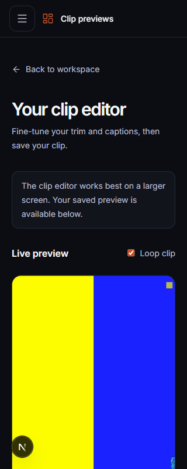

# VS5 verification

Date: 2026-09-14 (Asia/Manila). Final quality gate passed at 01:06.

Result: 489 unit tests and 58 PostgreSQL/Redis integration tests passed. Formatting, lint,
TypeScript, and production builds passed. The eight integration suites skipped by the unit runner
were run separately by the integration gate.

VS5-T1 through VS5-T8 were verified against a synthetic local account and a 30-second generated
source video. The fixture includes two primary clips, timestamped transcript phrases, and speech
gaps. It uses the real authenticated API, PostgreSQL functions, private source manifest, and byte-range
streaming endpoint. No AI service or render worker is needed for editing.

## Automated checks

- Shared contracts: full-source bounds, disabled captions, unique/known line IDs, invalid settings,
  source-timed projection, transcript gaps, and projections longer than 200 lines.
- API: authentication, UUID/body validation, owner/resource identifiers, conflict/not-found/error
  envelopes, malformed persistence responses, and no overwrite retry.
- PostgreSQL: existing VS4 defaults; owner-only reads/writes; denied runtime table updates and
  processing-role access; atomic rejection; current-job fencing; concurrent revision conflicts;
  unchanged baseline and retained text/highlights after shortening and extending saved trims.
- Browser-state helpers: incomplete numeric input, edits made during a save, safe text highlighting,
  whole-word/phrase matching, connection failures, and conflict responses.
- Full `pnpm ci:check`: formatting, lint, type checking, unit tests, PostgreSQL/Redis integration tests,
  and production builds. The existing Next.js file-tracing warning remains non-fatal.

## Browser scenarios

- Extended a 2–8 second AI clip to 0–30 seconds; captions from newly included transcript regions
  appeared immediately, with no caption displayed at the 9-second speech gap.
- Changed text, position, and font size; added the phrase `best ideas` and verified its ember styling.
- Saved and reloaded; trim, text, position, size, and highlights were restored from PostgreSQL.
- Disabled captions, saved, and reloaded; the overlay remained disabled.
- Verified invalid/incomplete trim input disables Save and valid millisecond input preserves playback
  boundaries. Seeking before trim start returned to the selected start.
- Switching clips with dirty state opened Save / Discard / Cancel. Cancel kept the current clip.
- Application navigation and sign-out use the same dialog; keyboard focus starts on Cancel and stays
  inside the modal. Cancel retained the draft. Discard followed by sign-out cleared recovery drafts
  for both the active clip and another clip in the same account.
- Simulated a delayed PATCH and typed during the request; the newly typed text remained dirty after
  the submitted snapshot saved. Cancelling Save & leave during a delayed save prevented navigation.
- Simulated a failed connection; the draft remained editable and retryable.
- Made a competing authenticated save; the stale editor received a conflict and retained its draft.
  Reload invoked the native unsaved warning, then offered recovery with a newer-version notice.
- Browser Back/Forward retained the unsaved editor draft; source playback and local text state were
  restored when returning.
- Checked 320, 768, 1024, and 1440 pixel layouts. No horizontal overflow; mobile shows the
  larger-screen recommendation and tablet offers clip/settings panel switching.
- Inspected network activity: metadata GET/PATCH and source-video reads only; no render or analysis
  request occurs during edits. A database check confirmed zero render jobs, one original analysis
  fixture job, and zero credit ledger entries for the synthetic account.

The ignored `storage/vs5-smoke` folder contains the disposable fixture and browser capture material.
It is local runtime data and must not be committed.

## Screenshots

Desktop, with a synthetic source and saved caption highlight:

Mobile preview and larger-screen guidance:

